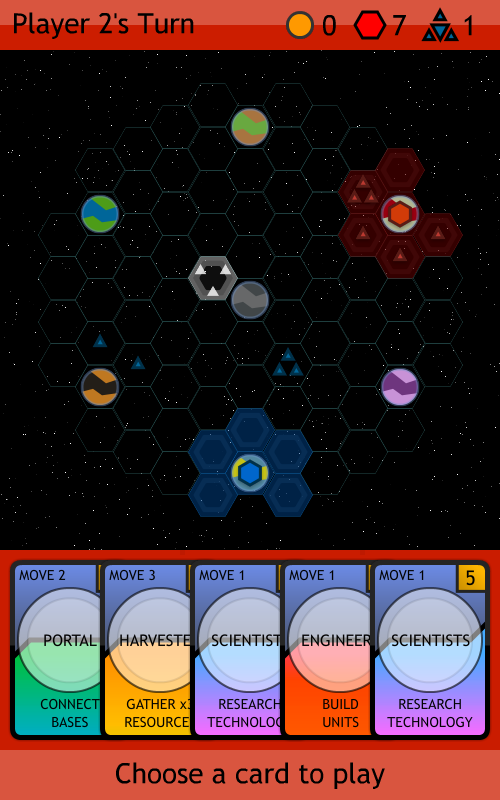
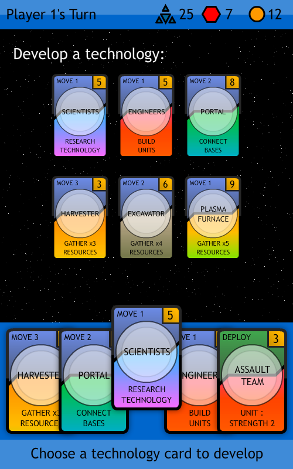

LD30 - Connect the worlds, rule the universe
============================================

My entry for Ludum Dare 30.

    Connect the worlds, rule the universe.

Available to play online at http://mkv25.net/ludum/ld30/preview/

Envisaged as a board game, with cards, a space map, worlds, and unit counters. There's a printable set of rules and a set of cards. I'm also working on a web based and mobile (Android) based version written in Haxe + OpenFL.

Ludum Dare submission: http://www.ludumdare.com/compo/ludum-dare-30/?action=preview&uid=10967

